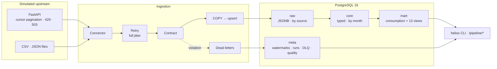

# Production Data Engineering Pipeline

[](https://github.com/legend-cell05/production-data-engineering-pipeline/actions/workflows/ci.yml)
[](https://www.python.org/)
[](https://www.postgresql.org/)
[](https://fastapi.tiangolo.com/)
[](https://docs.docker.com/compose/)
[](https://docs.astral.sh/ruff/)
[](https://mypy-lang.org/)
[](LICENSE)

An incremental, multi-source ingestion pipeline for energy meter telemetry:
watermarks with a late-arrival grace window, content-hash idempotency,
exponential backoff with full jitter against a source that fails on purpose, a
dead-letter queue that can be replayed, and a partitioned PostgreSQL warehouse
with 18 graded data-quality checks.

> ### ⚠️ Synthetic data
>
> **Helios Energy does not exist.** Every site, meter, tariff, weather
> observation and reading in this project is generated by the code in this
> repository. Nothing here describes a real company, a real customer or a real
> energy estate, and no figure should be quoted as though it did. The project
> has never been deployed to a production environment.

---

## Table of contents

1. [The problem](#the-problem)
2. [Objectives](#objectives)
3. [Features](#features)
4. [Architecture](#architecture)
5. [Tech stack](#tech-stack)
6. [Project structure](#project-structure)
7. [Installation](#installation)
8. [Configuration](#configuration)
9. [Database setup](#database-setup)
10. [Usage](#usage)
11. [The data model](#the-data-model)
12. [Incremental ingestion](#incremental-ingestion)
13. [Data quality](#data-quality)
14. [Observability](#observability)
15. [Testing](#testing)
16. [Docker](#docker)
17. [CI/CD](#cicd)
18. [Results](#results)
19. [Limitations](#limitations)
20. [Future improvements](#future-improvements)
21. [Security considerations](#security-considerations)
22. [Author](#author)

---

## The problem

An energy retailer collects 15-minute readings from meters across its
customers' sites. The meters are cumulative registers, the platform that
collects them exposes an HTTP API with cursor pagination and a rate limit, and
the data arrives imperfectly: meters go offline and flush their buffer hours
later, registers wrap around, replaced meters start from zero, and the
occasional payload is malformed.

Loading that once, by hand, is a morning's work. Loading it **every fifteen
minutes, forever, without anyone watching** is a different problem, and it is
the one this project is about. Four questions decide whether a pipeline
survives contact with a scheduler:

| Question | Answer here |
| --- | --- |
| Where did I get to? | Per-source **watermark** with a late-arrival grace window |
| What if I read the same thing twice? | **Content hash** in raw, guarded upsert in core, per-day rebuild in the mart |
| What if the source is down? | **Exponential backoff with full jitter**, `Retry-After` obeyed, transient errors only |
| What if one record is broken? | **Dead-letter queue** with the failing field named, and a replay path |

Every one of those has a failure mode that is *silent* — data that is missing
rather than wrong, noticed weeks later when a monthly total does not match.
That is what makes them worth building carefully.

## Objectives

- Ingest five heterogeneous sources — an HTTP API, two CSV files, one nested
  JSON file — through a single, uniform contract layer.
- Be **incremental**: re-running the pipeline costs a bounded re-read, not a
  full reload.
- Be **idempotent**: proven by running the whole pipeline twice in CI and
  comparing both row counts and totals.
- Be **resilient**: the simulated source fails 15% of requests in CI, and CI
  passes anyway.
- Turn cumulative meter registers into trustworthy consumption, including the
  cases where the register lies.
- Make the pipeline's own state — watermarks, runs, dead letters, quality —
  queryable rather than buried in logs.

## Features

**Ingestion**

- Five sources behind one `Source` protocol; adding one is a class and a
  contract entry, not a change to the runner, the schema or the loader.
- Cursor pagination keyed `(updated_at, reading_id)`, so ties at one-second
  resolution cannot skip or repeat a record.
- Retry with exponential backoff and **full jitter**; `Retry-After` wins when
  the server sends one; only transient errors are retried.
- Versioned schema contracts registered in `meta.schema_contract`, validating
  and normalising before anything is buffered.
- `COPY` → temp table → `INSERT … ON CONFLICT DO NOTHING`, at ~17 000 rows/s.

**Warehouse**

- Four schemas: `raw` (JSONB, LIST-partitioned by source), `core` (typed,
  RANGE-partitioned by month), `mart` (consumption + 13 views), `meta`.
- Monthly partitions created lazily, so a backfill into an old month just works.
- BRIN indexes on time-ordered columns, partial indexes where they earn their
  place.

**Consumption**

- Cumulative register → interval delta, with per-meter classification of
  `rollover`, `reset`, `correction`, `gap`, `flat`, `first_reading` and
  `implausible`.
- Degree-days (HDD/CDD, base 18 °C) joined to weather for normalised analysis.
- Tariff bands validated to tile the day with no gap and no overlap.

**Operations**

- 18 data-quality checks at three severities; only BLOCKING fails a run.
- Dead-letter queue with attempt counting, `ABANDONED` transition and replay.
- `meta.pipeline_run` per run; Prometheus metrics at `/pipeline/metrics`.
- 17 CLI commands, one per pipeline task, all independently retryable.

## Architecture



The layer boundary that matters is what can be rebuilt: `core` and `mart` can be
dropped and regenerated at any time; `raw` and `meta` cannot, because once the
API cursor has moved past a record, the `raw` row is the only copy.

Full diagrams, the ingestion sequence and the performance numbers are in
[docs/architecture.md](docs/architecture.md).

## Tech stack

| Layer | Choice | Why |
| --- | --- | --- |
| Language | Python 3.11 / 3.12 | Typed throughout; `mypy --disallow-untyped-defs` |
| Database | PostgreSQL 16 | Partitioning, JSONB, `COPY`, BRIN, window functions, `PERCENTILE_CONT` |
| DB access | SQLAlchemy 2.0 Core + psycopg 3 | Bound parameters everywhere; raw connection for `COPY` |
| Config | Pydantic v2 + pydantic-settings | Validation at start-up, `SecretStr` for the password |
| Simulated source | FastAPI + Uvicorn | Real HTTP, real pagination, real 503s |
| HTTP client | httpx | Timeouts and connection pooling |
| CLI | Typer + Rich | One command per pipeline task |
| Tests | pytest | 133 tests, 84 unit + 49 integration |
| Quality | Ruff, mypy | Both clean, enforced in CI |
| Container | Docker multi-stage | Non-root UID 10001, asserted in CI |
| CI | GitHub Actions | Lint, test matrix, end-to-end pipeline, image build |

No dbt, no Airflow, no Spark: 167 000 rows do not need a cluster, and adding one
would be the wrong lesson. [docs/orchestration.md](docs/orchestration.md) shows
what the Airflow DAG would look like, and says when each alternative would
actually be the better choice.

## Project structure

```
production-data-engineering-pipeline/
├── src/helios/
│   ├── api/                  # Simulated upstream + pipeline observability
│   │   ├── app.py            # FastAPI application
│   │   ├── store.py          # Cursor-paginated reading store
│   │   └── routers/          # /source/* and /pipeline/*
│   ├── contracts/            # Versioned schema contracts, validation, hashing
│   ├── db/                   # Engine, SQL file loading, schema management
│   ├── generation/           # Deterministic synthetic upstream
│   ├── ingest/               # Watermarks, dead letters, the ingest runner
│   ├── load/                 # COPY loader, raw → core → mart promotion
│   ├── quality/              # 18 graded checks
│   ├── sources/              # Source protocol, retry policy, connectors
│   ├── cli.py                # 17 commands
│   ├── config.py             # Settings, validation, SecretStr
│   ├── pipeline.py           # Task functions the CLI and tests both call
│   └── run_record.py         # meta.pipeline_run context manager
├── sql/
│   ├── schema/               # 001 schemas … 006 mart
│   ├── queries/              # promote_reference, promote_readings, refresh_consumption
│   └── marts/                # 13 analytical views
├── tests/
│   ├── unit/                 # Contracts, retry, sources, store
│   └── integration/          # Full pipeline, idempotency, marts
├── docs/                     # architecture · data-model · incremental · operations
│                             # · decisions · security · orchestration
├── orchestration/airflow/    # Reference DAG (not deployed)
├── .github/workflows/ci.yml
├── docker-compose.yml        # postgres + api + pipeline
├── Dockerfile                # Multi-stage, non-root
├── Makefile
└── .env.example
```

## Installation

**Prerequisites**: Python 3.11+, PostgreSQL 16 (or Docker), `make` optional.

```bash
git clone https://github.com/legend-cell05/production-data-engineering-pipeline.git
cd production-data-engineering-pipeline

python -m venv .venv
source .venv/bin/activate          # Windows: .venv\Scripts\activate
pip install -e ".[dev]"

cp .env.example .env               # then edit it
```

Or, with Docker and nothing else installed:

```bash
cp .env.example .env
docker compose up --build
```

## Configuration

Everything is an environment variable prefixed `HELIOS_`, read from `.env`.
`.env` is git-ignored; `.env.example` is the documented template. The settings
most worth knowing:

| Variable | Default | What it controls |
| --- | --- | --- |
| `HELIOS_DB_*` | localhost/helios | Connection. The password is a `SecretStr` and never reaches a log |
| `HELIOS_API_BASE_URL` | `http://localhost:8000` | The simulated source. In Compose: `http://api:8000` |
| `HELIOS_API_PAGE_SIZE` | 5000 | Records per page; capped at 50 000 server-side |
| `HELIOS_RETRY_MAX_ATTEMPTS` | 5 | Retry budget per request |
| `HELIOS_LATE_ARRIVAL_GRACE_MINUTES` | 90 | How far back every run re-reads. **The most important knob in the project** |
| `HELIOS_SOURCE_FAULT_RATE` | 0.15 | Share of requests the source fails on purpose |
| `HELIOS_SOURCE_RATE_LIMIT_RATE` | 0.05 | Share rate-limited with `Retry-After` |
| `HELIOS_COPY_BATCH_SIZE` | 50000 | Rows per `COPY` chunk |
| `HELIOS_DLQ_MAX_ATTEMPTS` | 3 | Replays before a record is `ABANDONED` |
| `HELIOS_RANDOM_SEED` | 20260215 | Makes the generated universe reproducible |

Schema names are validated against `[a-z_][a-z0-9_]*` at start-up, so a hostile
value fails before a connection is opened.

`helios doctor` prints the resolved configuration (with the password masked) and
checks connectivity.

## Database setup

Local PostgreSQL:

```sql
CREATE USER helios_app WITH PASSWORD 'your_local_password';
CREATE DATABASE helios OWNER helios_app;
```

Then:

```bash
helios init-db
```

which creates the four schemas, all tables, the reading partitions for the
generated window, the 13 mart views, and registers the five schema contracts in
`meta.schema_contract`. It is safe to re-run.

To start over: `helios reset` (drops and recreates the schemas — it asks first).

## Usage

The whole thing, from nothing:

```bash
helios seed          # generate the simulated upstream systems
helios serve &       # start the source API on :8000
helios init-db       # create the warehouse
helios run           # ingest → promote → refresh → check
```

or `helios all`, which does seed, init-db and run in order.

**Day-to-day**

```bash
helios ingest --source meter_readings   # one source
helios promote                          # raw → core
helios refresh-marts --from-date 2026-09-01  # rebuild a window of days
helios quality                          # the 18 checks
helios watermarks                       # where each source has got to
helios partitions                       # reading partitions and their row counts
helios contracts                        # registered contract versions
```

**Recovery**

```bash
helios backfill meter_readings --since 2026-09-12T00:00:00Z
helios dlq show
helios dlq replay --source meter_readings
helios reset-source weather             # clear a watermark to force a full re-read
```

Every command exits `0` on success, `1` on a handled failure and `2` on misuse,
so a scheduler can act on the result without parsing output.

## The data model

```
raw.record                    JSONB, LIST-partitioned by source_name
  PK (source_name, natural_key, content_hash)
        │ promote_reference.sql / promote_readings.sql
        ▼
core.site ── core.meter ── core.meter_reading   RANGE-partitioned by month
core.tariff ── core.tariff_band                 PK (meter_id, reading_ts)
core.weather_observation
        │ refresh_consumption.sql
        ▼
mart.consumption_interval  +  13 views
```

The interesting table is `mart.consumption_interval`, because it is where a
cumulative register becomes a consumption figure — and where the register's
lies have to be caught. Each interval carries a `delta_flag`:

| Flag | Meaning | Consumption |
| --- | --- | --- |
| `ok` | Normal forward movement | The delta |
| `first_reading` | No predecessor | `NULL` |
| `gap` | Predecessor is more than one interval back | The delta, spread |
| `flat` | Register did not move | 0 |
| `rollover` | Register wrapped; wrapped delta is plausible **for this meter** | The wrapped delta |
| `correction` | Small backward step — a corrected read | 0 |
| `reset` | Backward step too large to be a correction — meter replaced | `NULL` |
| `implausible` | Forward step far beyond this meter's own scale | `NULL` |

`reset` yields `NULL`, never zero. Zero is a measurement; `NULL` is the absence
of one, and summing zeros understates a total silently.

Thresholds are derived **per meter** from that meter's own p95 and median
forward deltas. A global threshold cannot distinguish a wrap from a
replacement — see [ADR-013](docs/decisions.md#adr-013----meter-deltas-are-classified-per-meter-against-that-meters-own-scale)
for how that went wrong the first time.

Full table-by-table reference: [docs/data-model.md](docs/data-model.md).

## Incremental ingestion

The core of the project, documented at length in
[docs/incremental.md](docs/incremental.md). The short version:

```
next read starts at:  watermark − grace_window
watermark advances to: MAX(updated_at actually observed), via GREATEST()
```

Never to `now()` — that loses records the source had not yet produced. Never
strictly `>` the watermark — that loses records that commit out of stamp order.
Never backwards — that would make a backfill re-ingest everything since.

The grace window costs, measured:

| Second run of the day | |
| --- | --- |
| Records read | 347 |
| Records ingested | **0** |
| Duplicates absorbed | **347** |
| Duration | 4.8 s |

Three hundred and forty-seven records re-read and discarded by the primary key.
That is the entire price of the guarantee, and it appears in every run report
rather than being hidden.

It does not make loss impossible: a record arriving later than the window is
still missed, the generator produces some on purpose, and the honest
mitigations are detection (`mart.v_interval_completeness`) and repair
(`helios backfill`).

## Data quality

18 checks, three severities, recorded in `meta.quality_check` on every run.

| Severity | Behaviour | Examples |
| --- | --- | --- |
| **BLOCKING** | Raises `DataQualityError`, fails the run | `raw_not_empty`, `every_meter_has_site`, `no_negative_consumption`, `tariff_bands_tile_the_day` |
| **WARNING** | Recorded and printed | `interval_completeness_pct`, `reset_rate_pct`, `dead_letter_rate_pct`, `reading_freshness_hours`, `no_readings_in_default_partition` |
| **INFO** | Context for the others | `dead_letters_abandoned` and other context for the checks above |

A suite where everything fails the run gets switched off the first weekend a
completeness figure dips. A suite where nothing can fail is decoration. The
split is the point — and a warning that has been amber for a month should
become blocking or be deleted.

Two real bugs in this repository were caught by these checks rather than by
inspection:

- A naive rollover heuristic invented roughly **10⁹ kWh** of consumption. It
  surfaced as a `NumericValueOutOfRange`, not as a plausible wrong number.
- Small backward register steps were being classified as meter resets, turning
  corrections into hundreds of phantom replacements on an estate with four.
- An `implausible` reading was flagged but kept its 5 · 10⁸ kWh value, so views
  that filtered on the flag were right and a plain `SUM` was wrong by a factor
  of fifty. A flag that does not change the number is a flag nobody downstream
  honours; there is now a test asserting the unfiltered sum.

Both fixes are written up in [docs/decisions.md](docs/decisions.md). They are in
the README because "the checks caught something real" is the only evidence that
a quality suite is worth its maintenance.

## Observability

```bash
curl localhost:8000/pipeline/health      # layer row counts, last run
curl localhost:8000/pipeline/watermarks  # per-source cursor and lag
curl localhost:8000/pipeline/dlq         # dead letters by source and cause
curl localhost:8000/pipeline/metrics     # Prometheus text exposition
```

The metric to alert on is **not** "the pipeline failed" — a pipeline can succeed
perfectly while ingesting nothing:

```yaml
- alert: HeliosIngestionStalled
  expr: helios_watermark_lag_seconds{source="meter_readings"} > 3600
  for: 15m
```

Structured JSON logging (`HELIOS_LOG_FORMAT=json`), one `meta.pipeline_run` row
per run with a batch UUID, and diagnostic procedures for eight specific failure
modes are in [docs/operations.md](docs/operations.md).

## Testing

```bash
make test               # unit only, no database
make test-integration   # full suite, needs a live PostgreSQL
make check              # lint + typecheck + unit tests
```

| | Count |
| --- | --- |
| Unit tests | 84 |
| Integration tests | 49 |
| **Total** | **133** |

The integration tests run against a **real** PostgreSQL, not a mock. The SQL is
the thing under test here — partitioning, window functions, upserts, the
classification logic — and mocking a database proves that the mock works.

What the tests actually assert, beyond happy paths:

- Running the whole pipeline twice produces identical row counts **and**
  identical total kWh. Comparing only counts would miss an upsert that silently
  changed a value.
- A backfill does not duplicate rows and does not wind the watermark backwards.
- `"1234.50"` and `1234.5` hash identically after normalisation.
- The retry delay sequence matches the formula — `sleeper` and `rng` are
  injected, so this is asserted without waiting.
- An oversized page request is a **permanent** error, not a retried one.
- A hand-built 10-reading meter exercising every `delta_flag` sums to exactly
  280.0 kWh.

## Docker

```bash
cp .env.example .env
docker compose up --build
```

Three services, because that is the real shape of the problem: the database, an
API the pipeline does not control, and the pipeline. Collapsing the API into the
pipeline would remove exactly the part that makes retry and pagination worth
having.

```bash
docker compose run --rm pipeline watermarks
docker compose run --rm pipeline dlq show
docker compose run --rm pipeline backfill meter_readings --since 2026-09-12T00:00:00Z
```

The image is multi-stage (compilers stay in the builder), runs as **UID 10001**,
and healthchecks with `helios doctor`. No credential is baked into any layer.

> The images have **not** been built in the authoring environment, which has no
> Docker daemon. `docker compose config` validates, and the CI `docker` job
> builds and smoke-tests the image on every push.

## CI/CD

[`.github/workflows/ci.yml`](.github/workflows/ci.yml) — four jobs:

| Job | What it does |
| --- | --- |
| **lint** | `ruff check`, `ruff format --check`, `mypy`. Fast, no database, fails early |
| **test** | Python 3.11 and 3.12 against a PostgreSQL 16 service container; unit, integration and coverage |
| **pipeline** | Seeds, serves the API, initialises the warehouse and runs the pipeline end to end |
| **docker** | Builds the image, smoke-tests it, asserts it does not run as root |

The `pipeline` job does not just check the exit code. It asserts the properties
this README claims:

- a second run produces **zero** duplicated readings and **zero** rows in the
  default partition;
- a backfill duplicates nothing;
- the dead-letter queue is **non-empty** — zero would mean the contract is not
  being applied at all;
- the image's `id -u` is not `0`.

Fault injection stays **on** in CI. A retry policy that has never retried
anything is a retry policy nobody has tested.

> No badge here claims a passing state that has not been produced by a real run.
> The badge at the top reflects whatever the latest workflow run actually did.

## Results

Measured locally against PostgreSQL 16 with the default configuration
(40 sites, 60 meters, 30 days, 15-minute intervals). Reproduce with
`helios all`.

| | |
| --- | --- |
| Records read (first run) | 168 376 |
| Ingested / duplicates / dead-lettered | 167 683 / 667 / 26 |
| Transient retries survived | 4 |
| **First run** | **16.4 s** |
| **Second run (nothing new)** | **4.9 s**, 0 ingested |
| `core.meter_reading` | 166 835 rows; `core` 23 MB |
| `raw.record` | 167 683 rows; `raw` 103 MB |
| `COPY` throughput | ~17 000 rows/s into `raw` |
| Representative mart query | 13.5 ms |

Partitions:

| Partition | Rows |
| --- | --- |
| `meter_reading_202608` | 62 080 |
| `meter_reading_202609` | 104 755 |
| `meter_reading_default` | **0** |

Interval classification across 166 835 readings:

| `ok` | `gap` | `flat` | `reset` | `first_reading` | `correction` | `implausible` | `rollover` |
| --- | --- | --- | --- | --- | --- | --- | --- |
| 163 478 | 2 057 | 1 095 | 59 | 60 | 56 | 27 | 3 |

Static analysis and tests: ruff clean, `ruff format` clean, mypy clean across 39
source files, 133 tests passing.

These are single-machine figures from one container, not a benchmark. They are
here because "fast" without a number is not a claim.

## Limitations

Stated plainly, because a portfolio project that lists only its strengths is an
advertisement.

- **Not deployed anywhere.** No production environment, no users, no real data.
- **The data is synthetic and the generator is my own.** It was written to
  contain the anomalies the pipeline handles, which makes the pipeline look good
  at handling them. A real meter estate would surprise it.
- **Records later than the grace window are still lost** until a backfill. This
  is a property of the design, not a bug, and the generator produces some
  deliberately so the limitation is demonstrable.
- **Single node, single writer.** Concurrent runs would each advance the
  watermark; correct in outcome, wasteful in practice. `max_active_runs=1`
  rather than advisory locks.
- **Delta classification is a heuristic.** Per-meter percentiles are better than
  a global threshold, and still wrong for a meter with very little history.
- **The Airflow DAG has never been run.** It is checked in as a reference, and
  labelled as such in the file itself.
- **Docker images were not built during authoring** — no daemon available. CI
  builds them.
- **No secret manager, no dependency scanning, no read-only role.** See
  [docs/security.md](docs/security.md) §6 for the full gap list.
- **DST**: two days a year have 23 and 25 hours, so completeness deviates on
  exactly those dates. Documented, not smoothed away.

## Future improvements

In the order I would actually do them:

1. **`pip-audit` and image scanning in CI** — the cheapest real improvement.
2. **Secret scanning as a pre-commit hook** — `.gitignore` is a convention, a
   hook is a control.
3. **Separate database roles** — `helios_ingest` (write) and `helios_read`
   (select on `mart` only).
4. **Property-based tests** for the delta classifier with Hypothesis; the
   hand-built fixture covers the cases I thought of.
5. **Retention and partition lifecycle** — `DROP` partitions past N months, on
   a schedule rather than by hand.
6. **A bitemporal `core.meter_reading`** (`valid_time` / `transaction_time`)
   instead of widening the grace window indefinitely.
7. **dbt for `core` → `mart`** once the mart is a dozen models rather than one
   table and thirteen views — for the lineage and the tests, not the hype.
8. **Parquet export of `raw` to object storage**, so the expensive-to-lose
   layer is not tied to one PostgreSQL instance.

## Security considerations

Full write-up, including what is **not** done, in
[docs/security.md](docs/security.md).

- **No credential in the repository.** `.env` and `.env.*` are git-ignored with
  a `!.env.example` exception; `.env.example` holds obvious placeholders.
- **`SecretStr`** for the database password, so it cannot leak through a
  `repr()`, a debugger, or a well-meant `logger.info("config=%s", settings)`.
  Two properties exist — `dsn` and `safe_dsn` — so the safe one is the
  convenient one.
- **Every value is a bound parameter.** Identifiers, which cannot be bound, come
  from a validated allow-list (`[a-z_][a-z0-9_]*` for schemas), are generated
  (`meter_reading_%Y%m`), or come from `pg_catalog`.
- **The upstream is treated as untrusted**: contract validation before
  buffering, a server-enforced page cap, a malformed cursor returning 400 rather
  than 500, and a bounded retry budget.
- **Non-root container** (UID 10001), asserted in CI rather than trusted.
- The CI database password is plain text on purpose: it belongs to a container
  created and destroyed with the job. Storing it as a secret would imply it
  protects something.

## Author

**Ayman Bara** — Engineering student (ING2, Information Systems) at
EPISEN / Université Paris-Est Créteil, on a work-study programme.

Interested in data engineering, BI and data platforms. This repository is a
personal portfolio project: the code, the synthetic data, the documentation and
the bugs described above are all mine.

- GitHub: [legend-cell05](https://github.com/legend-cell05)

## License

MIT — see [LICENSE](LICENSE).
