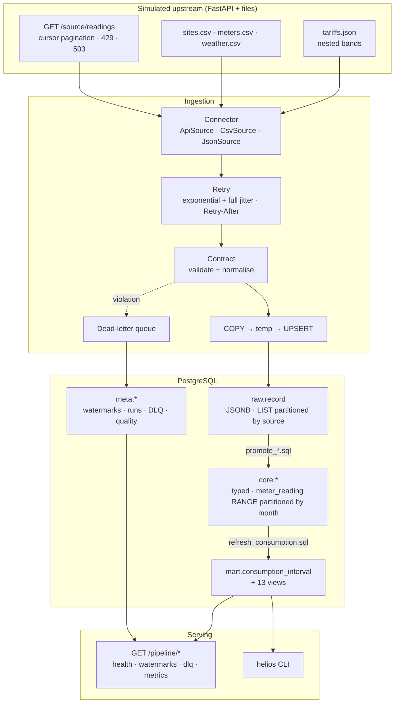
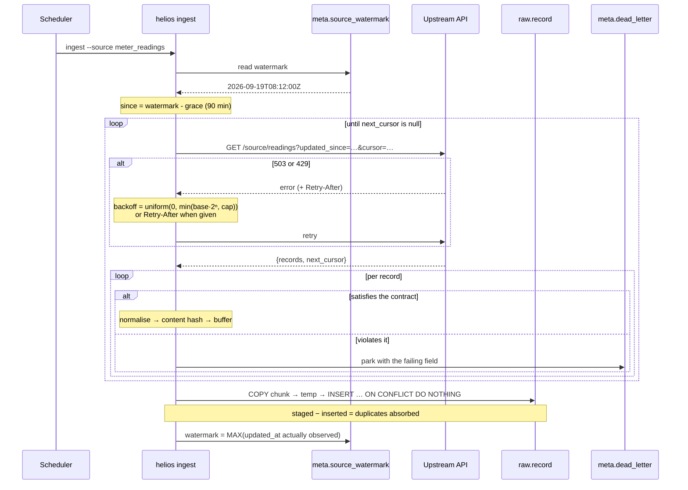

# Architecture

> Synthetic data throughout. Helios Energy is an invented company.

## Overview



## The four layers

| Layer | Contents | Retention | Rebuildable from |
| --- | --- | --- | --- |
| `raw` | JSONB payloads exactly as received | Indefinite | **Nothing** -- once the API cursor has moved past a record, this row is the only copy |
| `core` | Typed, conformed entities | Indefinite | `raw` |
| `mart` | Derived consumption and 13 views | Per-day rebuildable | `core` |
| `meta` | Watermarks, runs, dead letters, quality | Indefinite | Nothing -- losing it loses the pipeline's memory of where it got to |

That table is the whole reason the layers exist. `core` and `mart` can be
dropped and rebuilt at any time; `raw` and `meta` cannot, which is what decides
what gets backed up and what gets a `DROP ... CASCADE` during a schema change.

## Ingestion, step by step



Three orderings in that diagram are load-bearing:

**The watermark is read before the fetch and written after the load.** Writing
it first loses records on a crash. Writing it to `now()` instead of to the
highest value actually seen skips records the source had not yet produced.
Both failures are silent.

**Validation happens before the buffer, not after the load.** A record that
cannot be typed never reaches the database, so `raw` holds only payloads that
satisfied a known contract version -- which is what makes promotion a pure SQL
cast with no defensive `CASE` statements.

**Duplicates are absorbed by the primary key, not filtered in Python.** The
pipeline does not need to know what it already has; it re-reads the grace
window every time and lets `ON CONFLICT DO NOTHING` decide. The difference
between rows staged and rows inserted is then a free measurement of what the
grace window costs.

## The layers in code

| Stage | Module | Responsibility | Failure mode |
| --- | --- | --- | --- |
| Connect | `sources/` | Speak HTTP, CSV or JSON | `TransientSourceError` → retried; `PermanentSourceError` → run fails |
| Retry | `sources/retry.py` | Backoff with full jitter | `RetryBudgetExhausted` → run fails, watermark unmoved |
| Validate | `contracts/` | Accept, normalise or refuse | `ContractViolation` → dead-lettered, run continues |
| Load | `load/copy_loader.py` | `COPY` into raw, idempotently | `LoadError` → chunk rolled back |
| Promote | `load/promote.py` | raw → core, set-based SQL | `LoadError` → transaction rolled back |
| Refresh | `load/promote.py` | core → mart, per day | `LoadError` |
| Check | `quality/checks.py` | Is this fit to publish? | `DataQualityError` on a blocker |

The only thing that knows a source speaks HTTP is `ApiSource`. Everything above
it sees a `Source` protocol: a name, a contract, and an iterator of dicts.
Adding a source is a class and a contract entry -- not a change to the runner,
the schema or the loader.

## Why an API instead of a file

A pipeline demonstrated against a local file never exercises the parts that
actually break in production: pagination that skips a row, a cursor that loops,
a 503 halfway through page 30, a rate limiter that expects to be obeyed.

So the upstream here is a FastAPI service that paginates by cursor, rate-limits
with `Retry-After`, and fails 15% of requests by default. The pipeline talks to
it over HTTP with no privileged access. In CI the fault injection stays **on**:
a retry policy that has never retried anything is a retry policy nobody has
tested.

## Performance

Measured on the default configuration (40 sites, 60 meters, 30 days,
15-minute intervals) in a single container:

| Step | Duration |
| --- | --- |
| Generate the simulated upstream (168 k records) | ~0.4 s |
| Ingest reference sources (343 records) | ~0.3 s |
| Ingest readings over HTTP: 168 376 read, 34 pages, 4 retries | ~9.7 s |
| Promote raw → core | ~3 s |
| Refresh the consumption mart | ~2 s |
| 18 quality checks | ~0.4 s |
| **Total `helios run`** | **~16.4 s** |
| **Second run (nothing new)** | **~4.9 s** |

Throughput on the raw load is roughly **17 000 rows/second** through
`COPY` → temp table → upsert. A multi-row `INSERT` on the same data takes
several times longer, which is the difference between a fifteen-minute schedule
that keeps up and one that builds a backlog.

Storage: `raw` 103 MB, `core` 23 MB, `mart` 51 MB for 167 k readings. Raw is larger because
JSONB stores its keys; that is the price of being able to replay a
transformation bug without asking the source for the data again.

A representative mart query -- consumption by site over the last week:

```
HashAggregate (actual time=13.51..13.52 rows=40)
  -> Bitmap Heap Scan on consumption_interval (actual rows=42234)
       -> Bitmap Index Scan on ix_consumption_date
Execution Time: 13.543 ms
```

## Why these choices

**PostgreSQL.** Declarative partitioning, BRIN indexes, `COPY`, JSONB,
`PERCENTILE_CONT`, window functions and real constraint enforcement -- the
model uses all of them. A document store would make the raw layer easier and
everything after it harder.

**Raw as one generic JSONB table, partitioned by source.** Adding a source
costs a connector and a contract, not a migration. The readings partition holds
two orders of magnitude more rows than the reference ones, and partitioning
keeps a scan of `sites` from touching them.

**`COPY` rather than `INSERT`.** See the throughput above. The two-step
`COPY` → temp → `ON CONFLICT` pattern is what buys both speed and idempotency;
`COPY` alone has no conflict handling.

**Set-based promotion.** Moving 167 000 rows into Python to type them and send
them back would be slower by an order of magnitude and would add nothing that
SQL does not already do.

**Consumption as a physical mart table, not a view.** The delta calculation is
a window function over the whole reading history. Running it on every dashboard
query would be wasteful, and the result only changes when new readings land.
Refreshing per day keeps it idempotent and makes a backfill cheap.

See [decisions.md](decisions.md) for the full set of trade-offs, each with the
condition that would make it the wrong choice.

## Security posture

- No credential in the repository; `.env` is git-ignored and `.env.example`
  holds obviously-local placeholders.
- `Settings.db_password` is a Pydantic `SecretStr`, so it cannot leak through a
  `repr()` or a log line; `safe_dsn` is the masked form used in logs.
- Schema names are validated as `[a-z_][a-z0-9_]*` before reaching any DDL.
- Every value is a bound parameter; identifiers -- which cannot be bound -- go
  through allow-lists or come from the system catalogue.
- The container runs as UID 10001, and CI asserts it.

Full write-up in [security.md](security.md).
