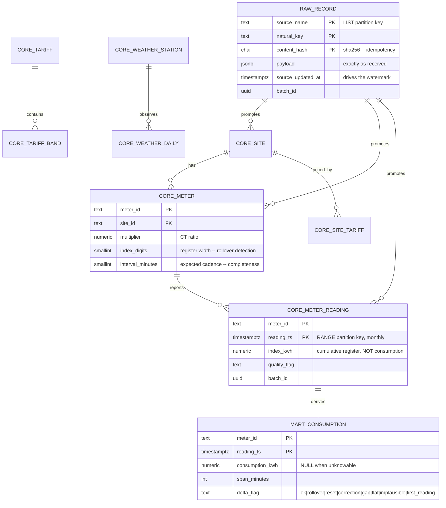

# Data model

> Synthetic data. No real site, meter or consumption figure.

## Layers



## The decision that shapes everything: store the index, not the consumption

A meter reports a **cumulative register value**, not how much it used. The
warehouse stores what the meter actually said, and derives consumption as a
difference in the mart layer.

Storing consumption directly would be simpler and would throw away the ability
to reconcile against the physical device — which is the one thing a customer
disputing a bill will ask for. It would also mean the rollover and reset logic
had to be right at ingestion time, with no way to fix it later; as it is, the
classification lives in one SQL file and a bug in it is repaired by re-running
`helios refresh-marts`.

The multiplier is stored rather than applied at the source for the same reason:
`index_kwh = register_value × multiplier`, and both halves are recoverable.

## Telling a rollover from a reset

The index went backwards. Two opposite meanings:

| | Meaning | Consumption |
| --- | --- | --- |
| **Rollover** | The register wrapped at `10^digits` | `(register_max − previous) + current` — exact |
| **Reset** | Meter replaced, register cleared, value corrupted | **Unknowable → NULL** |
| **Correction** | A substituted reading came back slightly lower | 0 — the index effectively did not move |

The obvious test — *was the previous index near the top of the register?* — is
wrong in the expensive direction. A meter sitting at 86% of its register that
is then reset to zero passes it, and the wrapped arithmetic invents 14% of a
register out of nothing. On an eight-digit register with a CT multiplier that
is a billion phantom kilowatt-hours **in a single row**, which then propagates
into every total above it.

This happened during development. The first implementation used exactly that
rule and produced a 42 GW average power reading.

The rule used instead is physical: compute the wrapped delta and ask whether it
is plausible for the time elapsed, calibrated per meter from its own interval
consumption.

```sql
p95_delta_kwh     -- generous: is this backward step small enough to be a
                  -- correction? is this wrapped delta credible?
median_delta_kwh  -- robust: is this FORWARD step absurd?
```

Two statistics because the two questions need different ones. A percentile is
the wrong tool for detecting a corrupt forward value: one reading of a million
inflates the p95 enough to make itself look normal — precisely the value the
check exists to catch. The median does not move.

Observed distribution on the default dataset (166 835 intervals):

| Flag | Rows | Usable |
| --- | ---: | --- |
| `ok` | 163 478 | yes |
| `gap` | 2 057 | yes — correct in total, approximate in attribution |
| `flat` | 1 095 | yes — the meter really did record nothing |
| `reset` | 59 | no — NULL |
| `first_reading` | 60 | no — no predecessor |
| `correction` | 56 | yes — counted as zero |
| `implausible` | 27 | no — corrupt |
| `rollover` | 3 | yes — wrapped arithmetic is exact |

99.9% usable. `mart.v_meter_health` reports the rest per meter, so the
exclusion is visible rather than quietly shrinking a total.

## Partitioning

**`raw.record` — LIST by `source_name`.** The readings partition holds two
orders of magnitude more rows than the reference ones. Partitioning keeps a
scan of `sites` from touching them, and lets one source be truncated and
re-ingested without a delete across the whole table.

**`core.meter_reading` — RANGE by month.** Every access pattern is
time-bounded: ingest the last few hours, rebuild yesterday's marts, backfill a
week, drop data past retention. Dropping a partition is instant; a `DELETE`
over a million rows is not.

Partitions are created lazily by the loader for exactly the months a batch
covers:

```sql
SELECT core.ensure_reading_partition(DATE '2026-09-01');
```

Creating them by hand does not survive contact with a scheduler — the first
insert after midnight on the 1st fails, every month, until someone automates
it. A `DEFAULT` partition catches anything outside the created ranges, and a
quality check fails if it is ever non-empty.

```
$ helios partitions
┏━━━━━━━━━━━━━━━━━━━━━━━┳━━━━━━━━━━━━━━┓
┃ partition             ┃  exact rows  ┃
┡━━━━━━━━━━━━━━━━━━━━━━━╇━━━━━━━━━━━━━━┩
│ meter_reading_202608  │       62,019 │
│ meter_reading_202609  │      104,758 │
│ meter_reading_default │            0 │
└───────────────────────┴──────────────┘
```

## Indexing

| Index | Type | Serves |
| --- | --- | --- |
| `ix_meter_reading_ts_brin` | **BRIN** | Every time-range scan |
| `ix_raw_readings_updated_brin` | **BRIN** | The watermark query |
| `ix_raw_record_batch` | b-tree | Batch-scoped promotion |
| `ix_consumption_date` / `_site_date` | b-tree | Mart queries |
| `ix_consumption_suspect` | **partial** | `delta_flag <> 'ok'` — a rare subset, so the index is tiny |
| `ix_dlq_pending` | **partial** | `status = 'PENDING'` |

BRIN rather than B-tree on the timestamps is the interesting one. Readings
arrive in roughly chronological order, so each block range covers a narrow time
span. A BRIN index on a million rows is a few dozen kilobytes against several
megabytes for a B-tree, and range scans are what every query here does. BRIN
would be useless on a randomly-ordered column — it works *because* of the
insertion pattern.

## Timezone

Storage is UTC. `reading_date` and `hour_of_day` are computed in
**Europe/Paris**, because "which day did this belong to" and "which tariff band
applies" are local-time questions.

The consequence is honest and unavoidable: on the DST transitions one local
hour occurs twice and one does not occur at all. A daily total on the October
Sunday covers 25 hours and on the March Sunday 23. `v_interval_completeness`
will show 100 of 96 expected intervals on one and 92 on the other. Normalising
that away would require a policy nobody has asked for; flagging it in a
document is the correct amount of engineering.

## Constraints

| Constraint | Why it exists |
| --- | --- |
| `pk_raw_record (source, key, hash)` | The idempotency guarantee, enforced by the database rather than by application logic |
| `pk_meter_reading (meter_id, reading_ts)` | The natural key; makes promotion an upsert |
| `ck_reading_index (index_kwh >= 0)` | A physical register cannot be negative |
| `ck_consumption_nonneg` | A negative delta means the rollover logic let one through |
| `ck_delta_flag` | Eight enumerated outcomes; a ninth is a code change, not a typo |
| `ck_meter_interval (1440 % interval = 0)` | A day must hold whole intervals or completeness is meaningless |
| `fk_meter_reading_meter` | Declared on the partitioned parent, inherited by every partition |
| `uq_dlq_record (source, natural_key)` | One entry per failing record, not one per failure |

During development `ck_consumption_nonneg` caught the rollover bug described
above before it reached a single aggregate.

## Volumes (default configuration)

| Object | Rows | Size |
| --- | ---: | ---: |
| `raw.record` | 167 683 | 103 MB (schema total) |
| `core.meter_reading` | 166 835 | 23 MB (schema total) |
| `mart.consumption_interval` | 166 835 | 51 MB (schema total) |
| `meta.dead_letter` | 26 | — |

Total usable consumption: ~23.5 GWh over 30 days across 40 invented sites.
