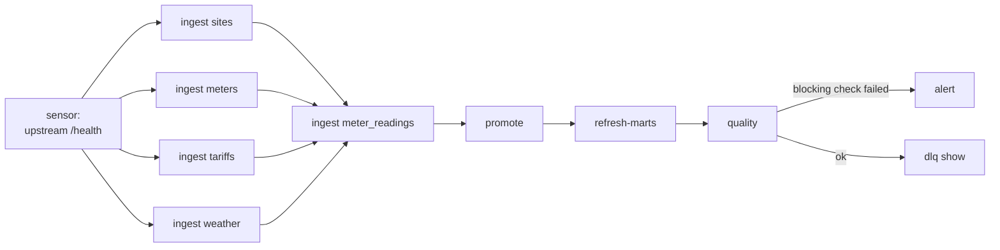

# Orchestration

The pipeline has no scheduler of its own, on purpose. Every operation is a CLI
command that is idempotent, independently retryable and reports its outcome
through an exit code, so an orchestrator only has to decide **when** to call
things -- never **what they mean**.

> The DAG below is written out in full and is syntactically valid, but Airflow
> is not a dependency of this project and the DAG has **not** been run against a
> live Airflow instance. It is included because the CLI's shape only makes sense
> once you see what it was shaped for. Do not read it as a deployment.

---

## 1. The contract the CLI offers a scheduler

| Property | How it is guaranteed |
| --- | --- |
| **Idempotent** | Content hash in raw, guarded upsert in core, delete-then-insert per day in the mart |
| **Retryable** | A failed run leaves the watermark unmoved, so a retry re-reads the same window |
| **Independently invocable** | Cross-task state lives in `meta.*`, not in process memory |
| **Honest exit codes** | `0` success · `1` handled failure · `2` misuse (bad argument) |
| **Observable** | `meta.pipeline_run` per run; `/pipeline/metrics` in Prometheus text format |
| **Bounded** | Retry budget and page cap, so a task cannot hang indefinitely on a sick source |

The consequence is that `helios ingest --source meter_readings` is safe to run
twice, safe to run late, and safe to run concurrently with yesterday's
`refresh-marts`. That is not an accident of implementation -- it is what
ADR-016 buys.

---

## 2. Task graph



Two orderings matter.

**Reference sources before readings.** A reading that names a meter which has
not been ingested yet cannot be promoted; it stays in raw and is picked up on
the next run. Ingesting `sites`/`meters` first means that is the exception
rather than the norm. The four reference sources are independent of each other,
so they fan out.

**Quality after the mart, not before.** Checking `core` and skipping the mart
would pass a run whose consumption table is empty. The gate belongs at the point
where the data becomes publishable.

---

## 3. The DAG

`orchestration/airflow/dags/helios_pipeline.py`:

```python
"""Airflow DAG for the Helios pipeline.

Every task is a `BashOperator` calling one `helios` command, because the CLI
already guarantees idempotency and retryability. Re-implementing any of that in
Python operators would create a second version of the pipeline's logic that
drifts from the first one.
"""

from __future__ import annotations

import datetime as dt
import pendulum
from airflow.models.dag import DAG
from airflow.operators.bash import BashOperator
from airflow.providers.http.sensors.http import HttpSensor
from airflow.utils.task_group import TaskGroup

REFERENCE_SOURCES = ("sites", "meters", "tariffs", "weather")

default_args = {
    "owner": "data-platform",
    "depends_on_past": False,
    # The retry here is the orchestrator's, and it is coarse: it re-runs the
    # whole task. The fine-grained retry against a flapping source lives in
    # `sources/retry.py`, where it knows the difference between a 503 and a 400.
    "retries": 2,
    "retry_delay": dt.timedelta(minutes=5),
    "retry_exponential_backoff": True,
    "max_retry_delay": dt.timedelta(minutes=30),
    "email_on_failure": False,
}

with DAG(
    dag_id="helios_pipeline",
    description="Incremental ingestion of meter telemetry into the Helios warehouse.",
    schedule="*/15 * * * *",
    start_date=pendulum.datetime(2026, 1, 1, tz="UTC"),
    catchup=False,
    # The watermark is the cursor, not the execution date: two concurrent runs
    # would both read from it and both advance it. One at a time.
    max_active_runs=1,
    dagrun_timeout=dt.timedelta(minutes=20),
    default_args=default_args,
    tags=["helios", "ingestion", "postgres"],
) as dag:
    upstream_available = HttpSensor(
        task_id="upstream_available",
        http_conn_id="helios_upstream",
        endpoint="health",
        # Fail rather than hold a worker slot: the next run is fifteen minutes
        # away and the watermark makes it lossless to skip this one.
        poke_interval=30,
        timeout=300,
        mode="reschedule",
    )

    with TaskGroup(group_id="reference") as reference:
        for source in REFERENCE_SOURCES:
            BashOperator(
                task_id=f"ingest_{source}",
                bash_command=f"helios ingest --source {source}",
            )

    ingest_readings = BashOperator(
        task_id="ingest_meter_readings",
        bash_command="helios ingest --source meter_readings",
        execution_timeout=dt.timedelta(minutes=10),
    )

    promote = BashOperator(
        task_id="promote",
        bash_command="helios promote",
    )

    refresh_marts = BashOperator(
        task_id="refresh_marts",
        # Rebuild today and yesterday: a late arrival inside the grace window
        # can change a day that has already been built. Bounded, and cheap
        # because the refresh is scoped per day.
        bash_command="helios refresh-marts --from-date {{ macros.ds_add(ds, -1) }}",
    )

    quality = BashOperator(
        task_id="quality",
        # Exits non-zero on a BLOCKING check, which is what fails the task.
        bash_command="helios quality",
    )

    dlq = BashOperator(
        task_id="dead_letter_report",
        bash_command="helios dlq show",
        # Reporting, not gating: a dead letter is not a reason to fail the run.
        trigger_rule="all_done",
    )

    upstream_available >> reference >> ingest_readings
    ingest_readings >> promote >> refresh_marts >> quality >> dlq
```

### The three decisions inside that file

**`max_active_runs=1`.** The watermark is the pipeline's shared cursor. Two
concurrent runs would each read it, each fetch overlapping windows, and each
advance it -- correct in outcome, because everything downstream is idempotent,
but wasteful and confusing in the run report. Serialising is cheaper than
explaining it.

**Two layers of retry, doing different jobs.** Airflow's retry re-runs a whole
task after five minutes; it handles a worker dying or the database being
restarted. The retry inside `sources/retry.py` handles a single 503 on page 30,
in under a second, without re-reading the twenty-nine pages before it. Removing
either would be worse: coarse-only wastes the run, fine-only cannot survive a
process death.

**The sensor is in `reschedule` mode with a timeout.** A source that is down for
an hour should not hold a worker slot for an hour. Skipping a run is lossless
here -- the watermark did not move, so the next run reads the same window plus
whatever accumulated. That property is why the sensor can be allowed to fail.

---

## 4. Backfilling from the orchestrator

A backfill is not a `catchup=True` rerun of the DAG. `catchup` replays
*schedules*, and this pipeline's cursor is a watermark rather than an execution
date, so replaying schedules does nothing useful. The operation is explicit:

```bash
helios backfill meter_readings --since 2026-09-12T00:00:00Z
```

which re-reads a bounded window, promotes, and rebuilds only the affected days.
Safe by construction (ADR-005, ADR-006, ADR-007), and `GREATEST` on the
watermark means it cannot wind the cursor backwards and trigger a re-ingest of
everything since.

As a triggerable DAG, that is a single `BashOperator` parameterised from
`dag_run.conf`:

```python
BashOperator(
    task_id="backfill",
    bash_command=(
        "helios backfill {{ dag_run.conf['source'] }} --since {{ dag_run.conf['since'] }}"
    ),
)
```

---

## 5. Alternatives, and when they would be better

| Orchestrator | When it would be the better choice here |
| --- | --- |
| **cron + the container** | A single pipeline on a single host. `docker compose run --rm pipeline run` in a crontab is genuinely enough, and an Airflow deployment to run one DAG is an operational cost with no return |
| **Dagster** | If the interesting unit were the *asset* rather than the task -- Dagster's asset graph would express `mart.consumption_interval` depends on `core.meter_reading` natively, which this DAG only implies through task order |
| **dbt** for `core` → `mart` | Once the mart is a dozen models rather than one table and thirteen views. dbt would bring lineage and testing for free; it would not help with ingestion, which is where the difficulty actually is |
| **Airflow** | Multiple pipelines, shared connections, backfills run by people who are not the author, and an SLA someone is accountable for |

The pipeline does not depend on any of them. That is the point: the scheduling
decision stays reversible, because the orchestration layer is a list of shell
commands rather than a rewrite of the logic.

---

## 6. What the orchestrator should alert on

Not "the DAG failed" -- by the time a task fails, the data is already late.

| Signal | Source | Why it is the right signal |
| --- | --- | --- |
| `helios_watermark_lag_seconds > 3600` | `/pipeline/metrics` | The pipeline can succeed while ingesting nothing; only the lag notices |
| `dead_letter_rate_pct` above threshold | `helios quality` | A schema change upstream shows up here before it shows up in a total |
| `interval_completeness_pct` dip | `mart.v_interval_completeness` | Catches arrivals later than the grace window, which nothing else catches |
| A run stuck in `RUNNING` | `meta.pipeline_run` | A killed process leaves the row behind; see `operations.md` |

Alerting rules and the diagnostic procedure for each are in
[operations.md](operations.md).
